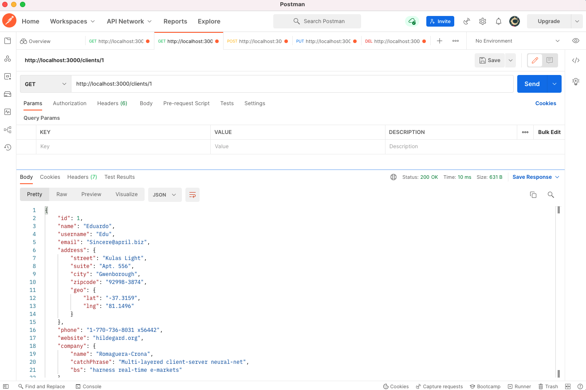
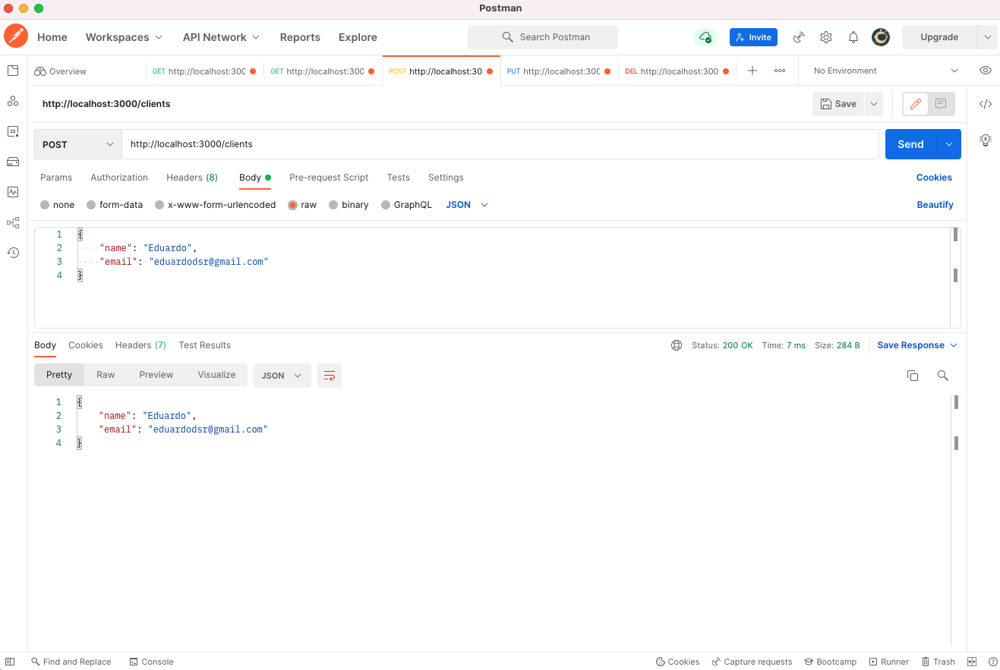
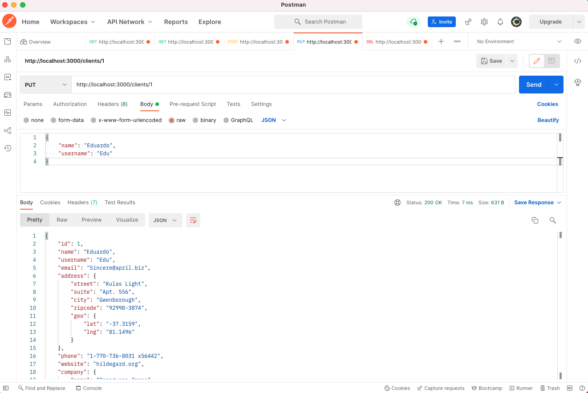
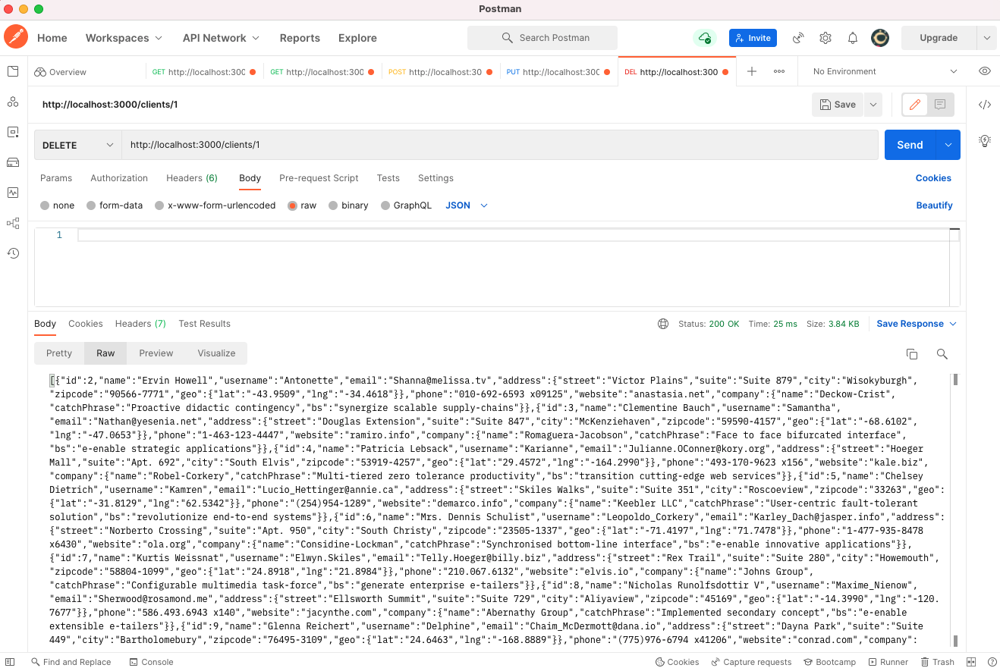

# API, REST e RESTFUL

#### YouTube

- O que é API ? REST e RESTful ? | Rocketseat | Mayk Brito

- https://youtu.be/ghTrp1x_1As

## API

- Cliente (Client)
- Garçom (pedidos, levar seus pedidos, para a cozinha) (API)
- Cozinha (Server)

Acrônimo de **Application Programming Interface (Interface de Programação de Aplicações)** é basicamente um conjunto de rotinas e padrões estabelecidos por uma aplicação, para que outras aplicações possam utilizar as funcionalidades desta aplicação.

- Responsável por estabelecer comunicação entre diferentes serviços.
- Meio de campo entre as tecnologias.
- Intermediador para troca de informações.

## REST

Acrônimo para **REpresentational State Transfer (Transferência de Estado Representativo)**.

Será feita a transferência de dados de uma maneira simbólica, figurativa, representativa, de maneira didática.

A transferência de dados, geralmente, usando o protocolo HTTP.

O REST delimita algumas obrigações nessas transferências de dados.

Resources seria então: Uma entidade ou um objeto.

### 6 NECESSIDADES (constraints) para ser RESTful

1. _**Uniform Interface**_: Manter uma uniformidade, uma constância, um padrão na construção da interface. Nossa API precisa ser coerente para quem vai consumi-lá. Precisa fazer sentido para o cliente e não ser confusa. Logo, coisas como: o uso correto dos verbos HTTP; endpoints coerentes (todos os endpoints no plural, por exemplo); usar somente uma linguagem de comunicação (json) e não várias ao mesmo tempo; sempre enviar respostas aos clientes; são exemplos de aplicação de uma interface uniforme.
   <br>
2. _**Client-server**_: Separação do cliente e do armazenamento de dados (servidor), dessa forma, poderemos ter uma portabilidade do nosso sistema, usando o React para WEB e React Native para o smartphone, por exemplo.
   <br>
3. _**Stateless**_: Cada requisição que o cliente faz para o servidor, deverá conter todas as informações necessárias para o servidor entender e responder (RESPONSE) a requisição (REQUEST).
   <br>
   Exemplo: A sessão do usuário deverá ser enviada em todas as requisições, para saber se aquele usuário está autenticado e apto a usar os serviços, e o servidor não pode lembrar que o cliente foi autenticado na requisição anterior. Nos nossos cursos, temos por padrão usar tokens para as comunicações.
   <br>
4. _**Cacheable**_: As respostas para uma requisição, deverão ser explicitas ao dizer se aquela resquição, pode ou não ser cacheada pelo cliente.
   <br>
5. _**Layered System**_: O cliente acessa a um endpoint, sem precisar saber da complexidade, de quais passos estão sendo necessários para o servidor responder a requisição, ou quais outras camadas o servidor estará lidando, para que a requisição seja respondida.
   <br>
6. _**Code on demand (optional)**_: Dá a possibilidade da nossa aplicação pegar códigos, como o javascript, por exemplo, e executar no cliente.
   <br>

## RESTFUL

RESTful, é a aplicação dos padrões REST.

## BOAS PRÁTICAS

- Utilizar verbos HTTP para nossas requisições.
- Utilizar plural ou singular na criação dos endpoints? _NÃO IMPORTA!_ use um padrão!!
- Não deixar barra no final do endpoint
- Nunca deixe o cliente sem resposta!

### VERBOS HTTP

- GET &rarr; Receber dados de um Resource.
- POST &rarr; Enviar dados ou informações para serem processados por um Resource.
- PUT &rarr; Atualizar dados de um Resource.
- DELETE &rarr; Deletar um Resource

### STATUS DAS RESPOSTAS

- 1xx: Informação
- 2xx: Sucesso
  - 200: OK
  - 201: CREATED
  - 204: Não tem conteúdo PUT POST DELETE
- 3xx: Redirection
- 4xx: Client Error
  - 400: Bad Request
  - 404: Not Found!
- 5xx: Server Error
  500: Internal Server Error

<br>

## Pratica (comandos Terminal)

### <code> yarn init -y </code>

```js
yarn init -y
```

### <code> yarn add express </code>

```js
yarn add express
yarn add v1.22.18
// ...
```

### <code> node server.js </code>

```js
node server.js
Server is running

```

## Postman

### GET

http://localhost:3000/clients

### GET

http://localhost:3000/clients/1

<!--

-->

### POST

http://localhost:3000/clients

```json
{
  "name": "X",
  "email": "X"
}
```

<!--

-->

### PUT

http://localhost:3000/clients/1

```json
{
  "name": "X",
  "email": "X"
}
```

<!--

-->

### DELETE

http://localhost:3000/clients/1

<!--

-->
